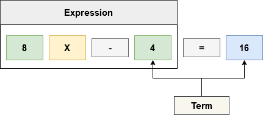

# Term

**Term** adalah sebuah **Mathematical Expression** tunggal.

Contoh : 

1. **3x** adalah **Single Term**, angka **3** adalah sebuah **Coefficient** dan **X** adalah sebuah **Variable**.
2.  juga sebuah **Single Term** dan  adalah **variables**.
3. **12** adalah **Single Term** sebuah **numerical term** yang disebut dengan **Constant**.

# Equation

**Equation** adalah terminologi yang digunakan untuk menjelaskan dua hal yang setara dalam matematika.

Sebagai contoh pada  terdapat dua hal yang dapat diuraikan

Disebelah kiri sebelum simbol  terdapat sebuah ekspresi  dan di sebelah kanan setelah simbol  terdapat angka 8.

Equation menegaskan bahwa  setara dengan 8.

## Equation Structure 

Pada  kita dapat membedah structure yang dimilikinya :  

  

Pada **Equation** di atas terdapat satu buah **Coefficient** yaitu 8, **Coefficient** adalah sebuah **Number** yang akan melakukan operasi **Multiply** terhadap suatu **Variable**. Pada **Equation** di atas  adalah sebuah **Variable** yang akan menjadi **Operand** untuk operasi **Multiply** dengan **Coefficient** 8.

Pada **Equation** di atas terdapat satu buah **Variable** yaitu , sebuah nilai yang belum diketahui saat ini.

Pada **Equation** di atas terdapat dua buah **Constant** yang nilainya sudah diketahui dan tidak dapat diubah.

Jika diurai lebih dalam lagi pada Equation  terdapat sebuah **Expression** dan **Terms** :

    

Istilah **Term** digunakan untuk menjelaskan sebuah angka tunggal dan **variable** tunggal.  

Istilah **Expression** digunakan untuk menjelaskan sekumpulan Term yang akan memproduksi sebuah nilai.
