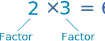

# Term

**Term** adalah sebuah **Mathematical Expression** tunggal. Istilah **Term** digunakan untuk menjelaskan sebuah angka tunggal dan **variable** tunggal.  

1. **3x** adalah **Single Term**, angka **3** adalah sebuah **Coefficient** dan **X** adalah sebuah **Variable**.
2.  juga sebuah **Single Term** dan  adalah **variables**.

# Prime Factorization

## Prime Number

**Prime Number** adalah :

- Sebuah **Whole Number** yang lebih dari satu 
- Sebuah **Whole Number** yang tidak bisa dibuat dari perkalian antar **whole number**
- Contoh **Prime Number** = 2, 3, 5, 7, 11, 13, 17, 19 dan 23,

**Whole Number** adalah number yang dapat diproduksi dari sebuah perkalian antar **Whole Numbers** disebut dengan **Composite Number**. 2 adalah **Prime Number**, 3 adalah **Prime Number**, 4 adalah **Composite Number** (=2×2), 5 adalah **Prime Number**, dan seterusnya.. 

## Factors

Faktor adalah **numbers** yang digunakan dalam perkalian untuk mendapatkan **number** lainnya :

## Prime Factorization

**Prime Factorization** adalah pencarian **prime numbers** yang dikalikan untuk membuat original **number**. 

1. Berapa **prime factors** dari **12** ?

   Bisa dimulai dari **prime number** terkecil terlebih dahulu yaitu 2 :

   **12 / 2 = 6**

   Tapi angka 6 bukan **prime number** jadi kita harus terus melanjutkan pembagian kembali :

   **6 / 2 = 3**

   Berhasil, kita telah mendapatkan angka 3 sebagai **prime number**. Dari operasi yang telah kita lakukan kita dapat menemukan jawabannya :

   **12 = 2 x 2 x 3**

   Seperti yang kita lihat **operand** yang digunakan dalam operasi perkalian di atas adalah **prime number**. 

2. Berapa **prime factorizarion** dari **147**?

   Jika angka 147 kita bagi dengan angka 2 maka hasilnya

   **147 / 2 = 73.5** 

   Hasilnya harus **whole number** dan 73.5 bukan **whole number**, jadi tidak bisa dilakukan.

   Jadi kita akan membaginya dengan **prime number** berikutnya yaitu angka 3 :

   **147 / 3 = 49**

   Berhasil, selanjutnya kita akan melakukan **factoring** pada angka 49.

   Angka **prime number** berikutnya adalah 5, dan tidak dapat digunakan untuk membagi angka 49, sehingga angka **prime number** berikutnya adalah 7 yang ternyata dapat digunakan untuk membagi angka 49.

   **49 / 7 = 7**

   Maka kita sudah bisa mendapatkan seluruh **factor** yang termasuk ke dalam **prime number**.

   

