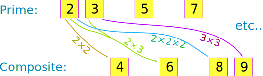

# Term

**Term** adalah sebuah **Mathematical Expression** tunggal. Istilah **Term** digunakan untuk menjelaskan sebuah angka tunggal dan **variable** tunggal.  

1. **3x** adalah **Single Term**, angka **3** adalah sebuah **Coefficient** dan **X** adalah sebuah **Variable**.
2.  juga sebuah **Single Term** dan  adalah **variables**.

# Prime Factorization

## Prime Number

**Prime Number** adalah :

- Sebuah **Whole Number** yang lebih dari satu 
- Sebuah **Whole Number** yang tidak bisa dibuat dari perkalian antar **whole number**
- Contoh **Prime Number** = 2, 3, 5, 7, 11, 13, 17, 19 dan 23,

**Whole Number** yang dapat diproduksi dari sebuah perkalian antar **Whole Numbers** disebut dengan **Composite Number**.

